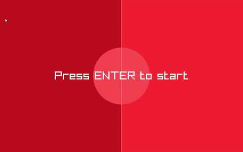

# GAGO - A Ping Pong Game in Golang

This project is a simple Ping Pong game developed in Go (Golang), leveraging the [Raylib](https://www.raylib.com/) library for graphics and game logic. This game was created as a part of exploring Raylib capabilities with Go.



## Features
- Classic Ping Pong gameplay
- Player vs. CPU
- Score tracking
- Simple and responsive controls

## Technologies Used
- **Go (Golang)**: The primary programming language.
- **Raylib-Go**: A Go-language binding for Raylib, a simple and easy-to-use library to enjoy videogames programming.

## Setup and Running (Windows)

To set up and run this game on Windows, follow these steps:

1.  **Remove Existing GCC (if any):** Ensure any previously installed GCC compiler is removed to prevent conflicts.
2.  **Install MinGW-w64:** Download and install MinGW-w64, then add its `bin` directory to your system's PATH environment variable. This provides the necessary C/C++ compiler toolchain for Raylib. (Alternatively, you can use `scoop install mingw` if you have Scoop package manager).
3.  **Install Go Dependencies:** Navigate to the project directory in your terminal and run:
    ```bash
    go mod tidy
    ```
4.  **Run the Game:** Execute the game with the following command:
    ```bash
    go run main.go
    ```

## Controls
- **Up Arrow**: Move player paddle up
- **Down Arrow**: Move player paddle down
- **Enter**: Start game from menu or restart game after game over

## RAYLIB CHEATSHEET
[CHEATSHEET](https://www.raylib.com/cheatsheet/cheatsheet.html)